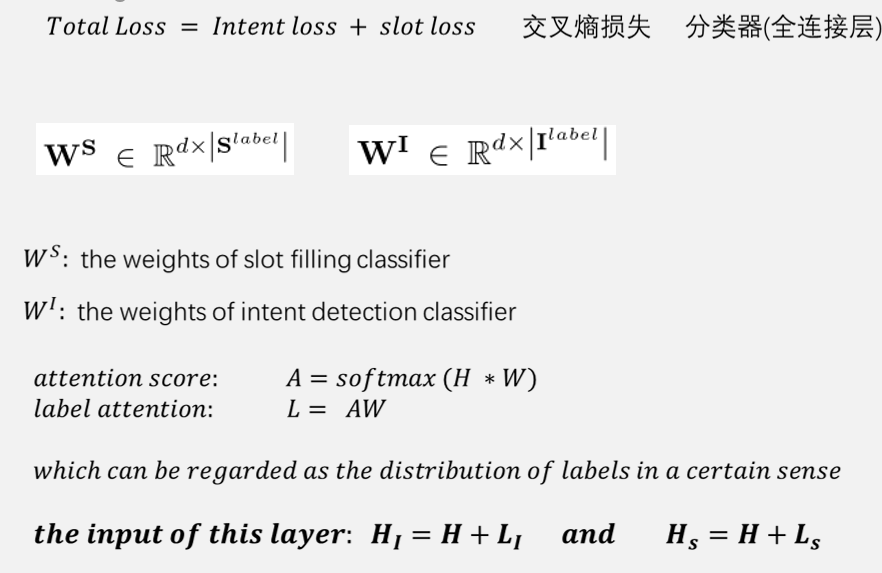
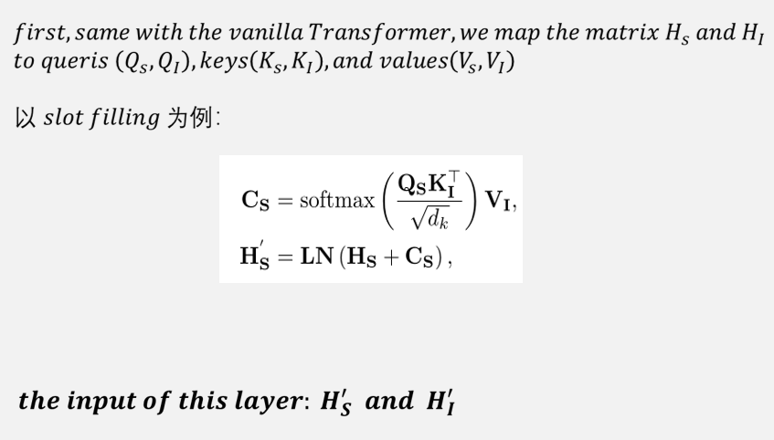
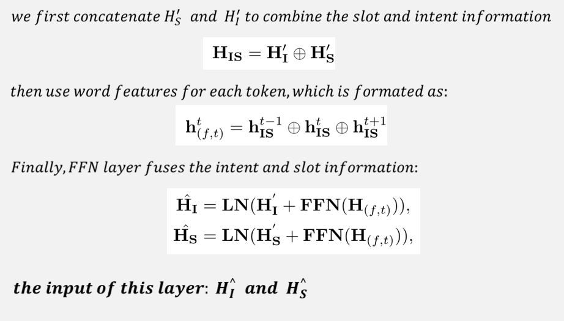
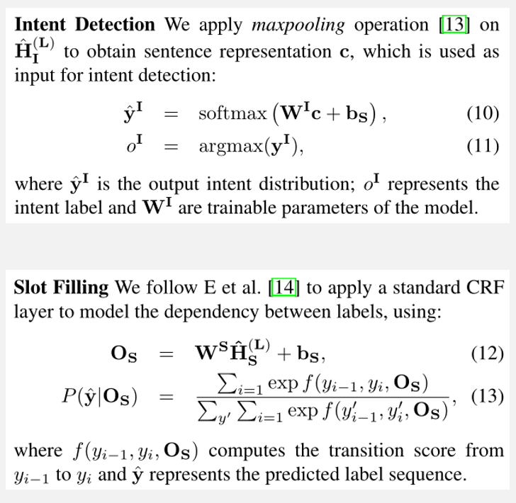

# 2021 CCF BDCI 全国信息检索挑战杯(CCIR-Cup) 智能人机交互自然语言理解赛道第二名解决方案（意图识别&槽填充）<br>
比赛网址: <a href='https://www.datafountain.cn/competitions/511'>CCIR-Cup-智能人机交互自然语言理解</a>
## 1.依赖环境：

* python==3.8
* torch==1.7.1+cu110
* numpy==1.19.2
* transformers==4.5.1
* scikit_learn==1.0
* seqeval==1.2.2
* tqdm==4.50.2
* CUDA==11.0

## 2.解决方案

### 1.数据预处理部分

1.首先对任务进行明确，赛题任务是意图识别与槽填充，在观察训练数据之后，发现槽填充任务可分解为两类任务来做：一类是标准槽填充任务，即槽值可在当前对话句子当中完全匹配到；另一类是非标准槽填充(自拟的名字)，即槽值不可在当前对话句子中找到或者完全匹配。对于非标准槽填充任务，把它当作另一种分类任务来解决。所以，我就把比赛任务当作三个子任务来进行，分别是意图识别、标准槽填充和非标准槽填充(分类任务)。

2.对于标准槽填充而言，有些槽标签在大部分训练数据中都是可完全匹配的，但是仍然存在少量不完全匹配槽标签，例如：句中出现的是港片、韩剧、美剧、内地、英文、中文等词汇时，对应的槽值标注却是香港、韩国、美国、大陆、英语、华语等。对于这一类数据，若将其当作非标准槽填充任务显得不太合理，解决方案是：提前准备好一个特殊词汇的映射字典 region_dic.json，在处理训练数据的时候，如果碰到了有的槽值出现在特殊词汇字典中，则对其进行槽标注的时候需要先进行转换。

3.然后用 ernie 的 Tokenizer 将对话句子按字切分，可能存在 ##后缀 和 [UNK] 的情况，将切分好的句子作为原始输入，对于标准槽填充任务，按 BIO 的方式进行标注。观察训练数据后发现，标准槽填充任务中存在少量的嵌套命名实体，例如:

```json
{
"NLU07301": {
    "text": "西安WE比赛的视频帮我找一下",
    "intent": "Video-Play",
    "slots": {
      "name": "西安WE比赛的视频",
      "region": "西安"
    }
  }
}
```

对于这种少量嵌套的例子，我并没有涉及特殊的网络结构来解决，而是使用了一种简单的方式：首先将每条训练数据的 slots 下的所有槽值的长度按从大到小排列，然后在对其进行序列标注的时候按槽的先后顺序进行标注，比如上面的例子的标注方式为：

首先是 "name" 这个槽标签:

```
B-name I-name I-name I-name I-name I-name I-name I-name I-name O O O O O
```

然后是 "region" 这个槽标签：

```
B-region I-region I-name I-name I-name I-name I-name I-name I-name O O O O O
```

"region" 标注完成后将 B-name I-name 这两个tag给覆盖掉了。

最后，对于这种嵌套实体，模型就按照这种标注方式去训练；在解码的时候，按照一定的匹配规则识别出"name" 和 "region"这两个槽标签，后面的实验中表明使用这种标注方式能够有效的识别出测试集数据中存在的嵌套实体。

4.手动纠正部分，训练数据中存在一些数据有着明显的标注错误。例如：NLU00400 的 "artist": "银临，河图"，正确的标注应该为 "artist": ["银临"，""河图"]；"query_type"："汽车票查询" 和 "query_type"："汽车票"，这两个明显就是一样的，故将其统一，再比如：

```json
{
  "NLU04386": {
    "text": "明天早上7:20你会不会通知我带洗衣液",
    "intent": "Alarm-Update",
    "slots": {
      "datetime_date": "明天",
      "notes": "带洗衣液",
      "datetime_time": "早上7"
    }
  }
}
```

"datetime_time"："早上7" 标注错误，正确标注应该为"datetime_time": "早上7:20"，且类似这种的错误在"Alarm-Update"这个意图中大量存在。如果不进行纠正，则对模型的训练会造成很大的影响。

5.对于非标准槽填充部分，统计出了四种槽标签：command、index、play_mode 和 query_type，将这四类槽标签的槽值当作类别，一共有29种类别，如：

```
音量调节
查询状态
汽车票查询
穿衣指数
紫外线指数
...
None
```

None表示不存在这一类值。然后对其进行类似意图识别那样做分类。

6.对于域外检测任务：在 a 榜阶段，我在 LCQMC 数据集中选择了1000条左右数据作为 Other 数据的来源；在 b 榜阶段，我把 a 榜阶段预测出的 intent 为 Other 的数据加上 LCQMC数据集中选择出500条数据一起作为训练集的 intent 为 Other 类进行训练。

7.对于小样本检测任务：发现意图为 Audio-Play 和 TVProgram_Play 的这两个意图是小样本数据，在原始训练集中分别为50条。解决方法：对小样本意图数据进行数据增强，使其数量接近基本任务数据的1000条左右，具体做法：分别对 Audio-Play 和TVProgram_Play这两个意图进行增强，举例来说，对于 Audio-Play 而言，其可能的槽标签有

8.在模型输出后，进行一步后处理操作：对模型预测结果进行纠正，即把不属于某一类intent的槽值删除，首先统计出训练数据中的意图和槽标签之间的关系：<br>
```json
{
  "FilmTele-Play": ["name", "tag", "artist", "region", "play_setting", "age"],
  "Audio-Play": ["language", "artist", "tag", "name", "play_setting"],
  "Radio-Listen": ["name", "channel", "frequency", "artist"],
  "TVProgram-Play": ["name", "channel", "datetime_date", "datetime_time"],
  "Travel-Query": ["query_type", "datetime_date", "departure", "destination", "datetime_time"],
  "Music-Play": ["language", "artist", "album", "instrument", "song", "play_mode", "age"],
  "HomeAppliance-Control": ["command", "appliance", "details"],
  "Calendar-Query": ["datetime_date"],
  "Alarm-Update": ["notes", "datetime_date", "datetime_time"],
  "Video-Play": ["name", "datetime_date", "region", "datetime_time"],
  "Weather-Query": ["datetime_date", "type", "city", "index", "datetime_time"],
  "Other": []
}
```
就可以发现意图只能包含特定的标签，某些标签不可能出现在其它意图中<br>
举例来说：比如我在一条测试数据中预测出其intent = FilmTele-Play, 然后其槽值预测中出现了"notes"这个槽标签，这与我之前统计的哪些槽标签只出现在哪些意图中不符合（即训练数据中FileTele-Play这个意图不可能出现"notes"这个槽标签），所以该函数就把"notes"这个槽位和槽值删除掉。

"Audio-Play": ["language", "artist", "tag", "name", "play_setting"]， 一共五类，分别在训练数据中统计出各个槽标签可能出现的槽值有哪些，比如 "language": ["日语", "英语", "法语", "俄语", "西班牙语", "华语", "韩语", "德语", "藏语"] ，language 有这些可选项，当然也可以自己随便添加几个合适的选项。得到了一个这种字典后，对于每一条原训练数据中意图为 Audio-Play 的数据进行扩充，每一条扩充20条新数据，具体扩充方式：对于原数据而言，如果某一个槽标签出现，则在该槽标签对应的标签候选项中随机选择一个替换它，对原数据存在的每一个槽标签都进行这种操作，这样就增加了一条”新数据“，经过实验验证，小样本数据扩充前后，线上得分提升了两个点，证明这种方式还是效果不错的。<br>
9.在a榜阶段，训练数据包括三部分：原始训练数据 + 小样本意图扩充数据 + LCQMC数据集(1000条)当作域外数据；在b榜阶段，训练数据除了和a榜相同的部分外，还把模型在a榜测试集上的输出当作a榜测试集的标注，再将这些数据也添加到训练数据中进行训练，然后再去预测b榜测试集，所以b榜阶段的最终使用的训练集有13119条。<br>

### 2.模型算法部分

此次比赛我一共使用了三个模型进行训练，最后的结果 result.json 由三个模型的投票表决产生。

#### 1.JointErine 模型

思路参照：[BERT for Joint Intent Classification and Slot Filling](http://arxiv.org/abs/1902.10909v1)

预训练模型并没有使用中文版 bert base，而是使用的是百度的中文版 ernie-1.0 base，三个任务进行联合训练。意图识别和非标准槽填充使用 erine 模型的输出分别连接一个全连接层进行分类；标准槽填充得到 erine 的输出后，再将其输入到 CRF 层，erine预训练模型与CRF层采用不同的学习率，erine 的学习率是5e-5，CRF层的学习率是5e-2

#### 2.InteractModel_1 模型

思路参照：[A CO-INTERACTIVE TRANSFORMER FOR JOINT SLOT FILLING AND INTENT DETECTION](http://arxiv.org/abs/2010.03880v3)

仍然是三个任务联合训练，不同的是，意图识别和标准槽填充部分进行了一层交互，非标准槽填充未与上述二个任务进行交互，而是把预训练模型的输出 pooled_output 直接输入到全连接层中进行分类。

***交互层部分：***

首先使用中文版 ernie-1.0 base 预训练模型作为主体部分：
$$
对于输入的序列\{x_1,x_2,...,x_n\}(n是token的数量)，输入到中文版ernie-1.0模型之后得到输出H = \{h_1, h_2, ..., h_n\}
$$
然后是意图和标准槽填充的交互层，这个模型中使用了一层交互层：

**标签注意力层**



**协同交互注意力层**



**前馈神经网络层**



***解码器层部分***



#### 3.InteractModel_3模型

InteractModel_3 模型结构类似于上述讲解的 InteractModel_1 ，唯一的区别就是 InteractModel_3 的意图识别和标准槽填充部分使用了三层的交互。<br>
**镜像复现说明请查看 ccir/image/README.md**

## 3.项目目录结构
```
ccir
|-- data                                                —— 数据文件夹
|   |-- code                                            —— 包含所有代码文件夹
|   |   |-- __init__.py
|   |   |-- model                                       —— 与网络模型相关文件夹
|   |   |   |-- __init__.py
|   |   |   |-- InteractModel_1.py                      —— InteractModel_1 网络模型
|   |   |   |-- InteractModel_3.py                      —— InteractModel_3 网络模型
|   |   |   |-- JointBertModel.py                       —— JointBertModel 网络模型
|   |   |   |-- __pycache__
|   |   |   |   |-- __init__.cpython-38.pyc
|   |   |   |   |-- InteractModel_1.cpython-38.pyc
|   |   |   |   |-- InteractModel_3.cpython-38.pyc
|   |   |   |   |-- JointBertModel.cpython-38.pyc
|   |   |   |   `-- torchcrf.cpython-38.pyc
|   |   |   `-- torchcrf.py                             —— CRF层网络模型
|   |   |-- predict                                     —— 包含推理代码的文件夹
|   |   |   |-- __init__.py     
|   |   |   |-- integration.py                          —— 负责将三个模型的结果进行投票输出成最后的结果result.json
|   |   |   |-- post_process.py                         —— 对模型的结果进行后处理的代码
|   |   |   |-- __pycache__
|   |   |   |   |-- __init__.cpython-38.pyc
|   |   |   |   |-- post_process.cpython-38.pyc
|   |   |   |   |-- test_dataset.cpython-38.pyc
|   |   |   |   `-- test_utils.cpython-38.pyc
|   |   |   |-- run_interact1.py                        —— 对线上训练的InteractModel_1模型进行推理
|   |   |   |-- run_interact3.py                        —— 对线上训练的InteractModel_3模型进行推理
|   |   |   |-- run_JointBert.py                        —— 对线上训练的JointBert模型进行推理
|   |   |   |-- run_trained_interact1.py                —— 对本地训练的InteractModel_1模型进行推理
|   |   |   |-- run_trained_interact3.py                —— 对本地训练的InteractModel_3模型进行推理
|   |   |   |-- run_trained_JointBert.py                —— 对本地训练的JointBert模型进行推理
|   |   |   |-- test_dataset.py                         —— 构建测试集dataset
|   |   |   `-- test_utils.py                           —— 测试集的工具类函数
|   |   |-- __pycache__
|   |   |   `-- __init__.cpython-38.pyc
|   |   |-- preprocess                                  —— 数据预处理代码
|   |   |   |-- __init__.py     
|   |   |   |-- analysis.py                             —— 分析训练数据，哪些意图包含哪些标签
|   |   |   |-- extend_audio_sample.py                  —— 用于扩充意图为”Audio-Play“的小样本数据
|   |   |   |-- extend_tv_sample.py                     —— 用于扩充意图为”TVProgram-Play“的小样本数据
|   |   |   |-- extract_intent_sample.py                —— 在训练数据中提取特定意图的数据
|   |   |   |-- generate_intent.py                      —— 对训练数据和验证集数据提取意图
|   |   |   |-- process_other.py                        —— 处理域外数据
|   |   |   |-- process_rawdata.py                      —— 处理原始训练数据和验证集数据
|   |   |   |-- rectify.py                              —— 对意图为”Alarm-Update“的训练数据进行纠正
|   |   |   |-- slot_sorted.py                          —— 对槽填充的标注按槽值从大到小进行排序
|   |   |   |-- split_train_dev.py                      —— 将原始训练数据按8: 2划分
|   |   `-- scripts
|   |       |-- build_vocab.py                          —— 构建词典，加载词汇表
|   |       |-- config_Interact1.py                     —— InteractModel_1的配置文件（参数设置）
|   |       |-- config_Interact3.py                     —— InteractModel_3的配置文件（参数设置）
|   |       |-- config_jointBert.py                     —— JointBert的配置文件（参数设置）
|   |       |-- dataset.py                              —— 构建训练集dataset
|   |       |-- __init__.py
|   |       |-- __pycache__
|   |       |   |-- build_vocab.cpython-38.pyc
|   |       |   |-- config_Interact1.cpython-38.pyc
|   |       |   |-- config_Interact3.cpython-38.pyc
|   |       |   |-- config_jointBert.cpython-38.pyc
|   |       |   |-- dataset.cpython-38.pyc
|   |       |   |-- __init__.cpython-38.pyc
|   |       |   `-- utils.cpython-38.pyc
|   |       |-- train_interact1.py                      —— InteractModel_1的主函数训练代码
|   |       |-- train_interact3.py                      —— InteractModel_3的主函数训练代码
|   |       |-- train_jointBert.py                      —— JointBert的主函数训练代码
|   |       `-- utils.py                                —— 训练阶段的工具类函数（train、valid等）
|   |-- __init__.py
|   |-- prediction_result                               —— 模型推理结果result.json的保存文件夹
|   |-- __pycache__
|   |   `-- __init__.cpython-38.pyc
|   |-- raw_data                                        —— 原始训练集文件夹
|   `-- user_data                                       —— 用户数据文件夹
|       |-- common_data                                 —— 训练和验证时使用的公共文件夹
|       |   |-- intent_label.txt                        —— 包含11类意图的txt文件
|       |   |-- intent_slot_mapping.json                —— 意图与槽标签对应关系的字典
|       |   |-- region_dic.json                         —— 用于帮助训练集槽标注的映射字典
|       |   |-- slot_label.txt                          —— 标准槽标签
|       |   `-- slot_none_vocab.txt                     —— 非标准槽标签
|       |-- dev_data
|       |   |-- dev_intent_label.txt                    —— 验证集数据的意图
|       |   |-- dev_seq_in.txt                          —— 验证集数据的原始句子分词输入
|       |   |-- dev_seq_out.txt                         —— 验证集数据的序列标注
|       |   `-- dev_slot_none.txt                       —— 验证集数据的非标准槽填充分类标签
|       |-- output_model                                —— 保存训练过程中间的模型文件夹
|       |   |-- InteractModel_1                         —— InteractModel_1文件夹(线上训练的模型保存在该文件夹下)
|       |   |   `-- trained_model                       —— 保存本地训练好的模型的文件夹
|       |   |       `-- Interact1_model_best.pth.tar    —— 本地训练好的InteractModel_1模型
|       |   |-- InteractModel_3                         —— InteractModel_3文件夹(线上训练的模型保存在该文件夹下)
|       |   |   `-- trained_model
|       |   |       `-- Interact3_model_best.pth.tar    —— 本地训练好的InteractModel_3模型
|       |   `-- JointBert                               —— JointBert文件夹(线上训练的模型保存在该文件夹下)
|       |       `-- trained_model
|       |           `-- bert_model_best.pth.tar         —— 本地训练好的JointBert模型
|       |-- pretrained_model                            —— 预训练模型文件夹
|       |   `-- ernie                                   —— ernie
|       |       |-- config.json
|       |       |-- pytorch_model.bin
|       |       |-- special_tokens_map.json
|       |       |-- tokenizer_config.json
|       |       `-- vocab.txt
|       |-- test_data                                   —— 测试集文件夹
|       |   |-- test_B_final_text.json                  —— 测试集原始json文件
|       |   `-- test_seq_in_B.txt                       —— 经过Tokenizer分词后的测试集文件
|       |-- tmp_result                                  —— 保存单个模型输出结果
|       `-- train_data                                  —— 训练集文件夹
|           |-- train_intent_label.txt                  —— 训练集数据的意图
|           |-- train_seq_in.txt                        —— 验证集数据的原始句子分词输入
|           |-- train_seq_out.txt                       —— 验证集数据的序列标注
|           `-- train_slot_none.txt                     —— 验证集数据的非标准槽填充分类标签
|-- image                                               —— 镜像相关文件夹
|   |-- readme_images                                   —— 存放赛题解决方案和算法介绍的README文档的图片
|   |-- ccir-image.tar                                  —— 镜像文件
|   |-- README.md                                       —— 关于复现具体操作的REDAME文档
|   |-- run_infer.sh                                    —— 使用本地训练的模型进行线上推理的脚本
|   `-- run.sh                                          —— 进行线上训练和推理的脚本
`-- README.md                                           —— 赛题整体的解决方案和算法介绍的README文档
```
